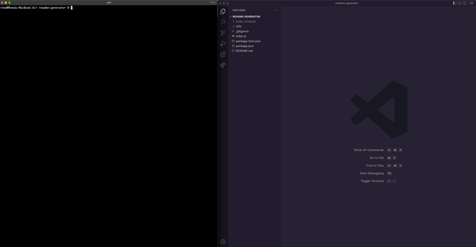

# Readme Generator

## Description

This application allows users to create professional ReadMe docs by running the index.js file in the console and answering the prompts. Once answered a readme will populate with the responses in the correct spaces. 

This helped me learn a lot more about javascript and how it is used on the backend. 

## Installation

To use this code, clone the repo down to your machine and open it via your console or in your code editor and run the index.js through node. 

## Usage

Once a user has access to the code, they are able to create easy to read and professional ReadMe's by answering a few questions.

Below is a demo of the process. For the full video please follow this link: https://drive.google.com/file/d/1XYRqpurf69xv3icPrfe2kBOrrFeyDWrR/view?usp=sharing

## Credits

Starter code provided by University of Denver Fullstack Bootcamp course.

## Features

- The application in run entirely through the console. 
